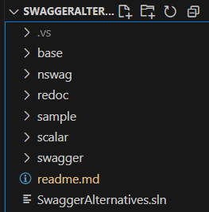

# SwaggerAlternatives

A collection of projects for users to explore alternatives to Swagger API documentation.

### Base
The `base` project is the starting point for all of the other projects and contains no OpenAPI documentation support.
### [nSwag](https://github.com/RicoSuter/NSwag)
The `nswag` project uses NSwag to create the OpenAPI documentation.
### [ReDoc](https://redocly.com/redoc)
The `redoc` project uses ReDoc to create the OpenAPI documentation.
### Sample
The `sample` project contains the sample data and the routes for the sample API.  It is used by all of the other projects.
### [Scalar](https://scalar.com/)
The `scalar` project uses Scalar to create the OpenAPI documentation.
### [Swagger](https://swagger.io/tools/swagger-ui/)
The `swagger` project uses Swagger UI to create the OpenAPI documentation.  This is Swagger, the widely used and original API documentation tool.

## Useful Links

- [Swagger Documentation](https://swagger.io/docs/)
- [Redoc Documentation](https://redocly.com/docs)
- [Scalar Documentation](https://guides.scalar.com/scalar/introduction)
- [NSwag Documentation](https://learn.microsoft.com/en-us/aspnet/core/tutorials/getting-started-with-nswag?view=aspnetcore-8.0&tabs=visual-studio)
- [OpenAPI Specification](https://swagger.io/specification/)
- [API Design Best Practices](https://www.martinfowler.com/articles/richardsonMaturityModel.html)

## License

This repository is licensed under the MIT License.
